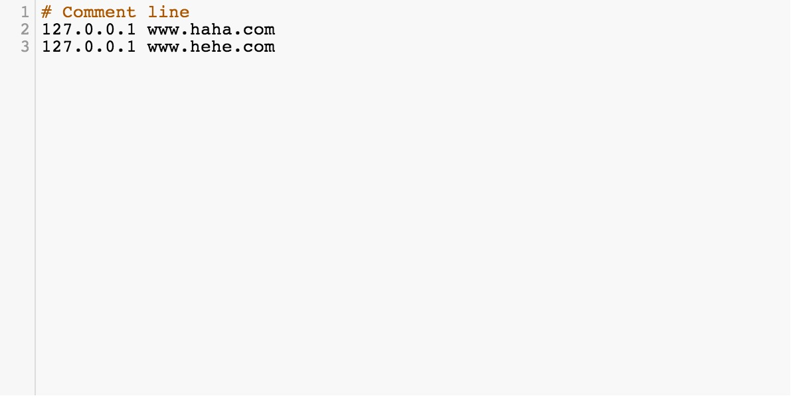

CodeMirror Hosts Mode
=====================

This is a [CodeMirror](https://github.com/marijnh/CodeMirror) mode for hosts file.

### Usage

Add `hosts.js` to your html

```
 <script src="hosts.js"></script>
```

Specify `hosts` mode when using CodeMirror.

```
 CodeMirror.fromTextArea(element, { mode: 'hosts' } );
```

### Screenshot


